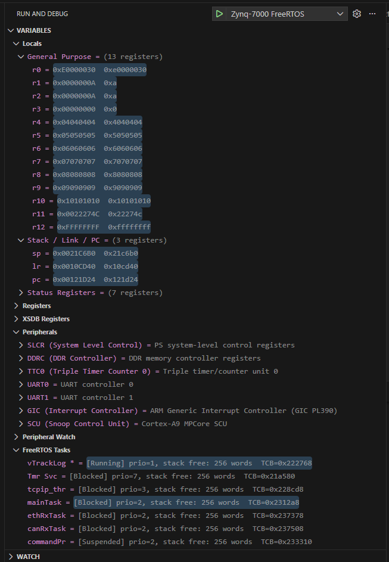
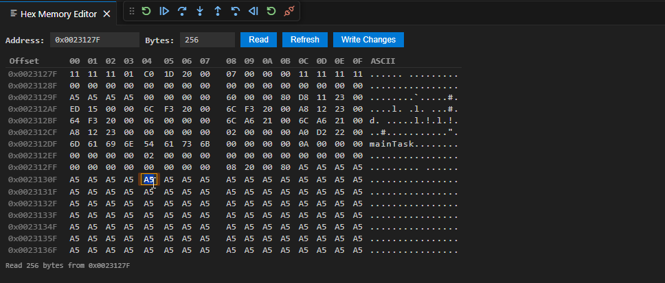

# Xilinx Native Debug

Xilinx Native Debug is a Visual Studio Code debugger extension for embedded and native targets, with first-class support for Xilinx workflows.

It focuses on:

- XSDB-driven board bring-up and runtime access
- GDB-based software debugging
- Zynq-7000, Zynq UltraScale+, Versal, and MicroBlaze targets
- classic native GDB, LLDB, and Mago-MI workflows where needed



## What this extension is for

This extension is designed for developers debugging:

- Zynq-7000 processing systems
- Zynq UltraScale+ MPSoC applications
- Versal platforms
- MicroBlaze software on FPGA designs
- mixed FPGA + processor bring-up flows
- remote GDB targets for embedded systems
- integrated RAM hex editor
- integrated COM port monitor, raw TCP monitor, telnet monitor



The main Xilinx workflow is provided by the `xsdb-gdb` debugger type:

- XSDB handles board connection, target selection, bitstream download, hardware handoff loading, PS init, reset, memory/register access, and custom Tcl commands
- GDB handles symbols, breakpoints, stepping, stack, variables, and source-level debugging

## Main features

### Xilinx / XSDB features

- `xsdb-gdb` debug type for combined XSDB + GDB debugging
- FPGA programming through XSDB
- hardware export loading via `.hdf` or `.xsa`
- PS init via `ps7_init.tcl` or `psu_init.tcl`
- target selection by filter or JTAG cable name
- runtime XSDB commands from the VS Code Debug Console using `xsdb:`
- XSDB memory read/write commands from the Command Palette
- board reset commands from the Command Palette
- optional XSDB command tracing

### Debug UX features

- grouped register scopes for Zynq cores
- peripheral register watch support
- linker map annotation for watched addresses
- optional FreeRTOS task awareness
- breakpoint revalidation after reset flows
- fail-fast path validation for Xilinx artifacts

### General native debug support

- GDB launch and attach
- LLDB support
- Mago-MI support for Windows targets
- SSH-based remote debugging
- gdbserver-based remote debugging
- manual MI command entry using `-` in the Debug Console

## Supported Xilinx targets

- Zynq-7000
- Zynq UltraScale+ MPSoC
- Versal
- FPGA-only bitstream/program flows
- MicroBlaze-based systems (not tested)

## Prerequisites

Typical Xilinx setup:

- Xilinx tools installed with `xsdb` or `xsdb.bat`
- reachable `hw_server`
- bitstream file (`.bit` or `.pdi`) if PL programming is required
- hardware handoff (`.hdf` or `.xsa`) if needed
- PS init Tcl script (`ps7_init.tcl` / `psu_init.tcl`) when required
- GDB and a reachable GDB endpoint such as `extended-remote localhost:3000`

For Windows, `xsdb.bat` is supported directly.

## Quick start: Zynq-7000 in VS Code

Use a launch configuration like this:

```json
{
  "type": "xsdb-gdb",
  "request": "attach",
  "name": "Debug Zynq-7000 Application",
  "xsdbPath": "C:/Xilinx/SDK/2019.1/bin/xsdb.bat",
  "hwServerUrl": "tcp:127.0.0.1:3121",
  "initTargetFilter": "APU*",
  "targetFilter": "ARM*#0",
  "jtagCableName": "Digilent JTAG-SMT1 210203859289A",
  "bitstreamPath": "./hw_platform/top_wrapper.bit",
  "hwDesignPath": "./hw_platform/system.hdf",
  "psInitScript": "./hw_platform/ps7_init.tcl",
  "loadhwMemRanges": ["0x40000000 0xbfffffff"],
  "forceMemAccess": true,
  "stopBeforePsInit": true,
  "resetType": "processor",
  "boardFamily": "zynq7000",
  "keepXsdbAlive": true,
  "gdbpath": "C:/msys64/mingw64/bin/gdb-multiarch.exe",
  "target": "extended-remote localhost:3000",
  "executable": "./build/app.elf",
  "cwd": "${workspaceRoot}",
  "remote": true,
  "stopAtConnect": true,
  "autorun": [
    "set print pretty on",
    "set confirm off",
    "file ./build/app.elf",
    "load"
  ]
}
```

## Debugger types

### `xsdb-gdb`

Primary Xilinx flow.

Use this when you want:

- XSDB board init
- FPGA programming
- PS initialization
- GDB source-level debugging

### `gdb`

Use for generic embedded/native GDB workflows that do not need XSDB orchestration.

### `lldb`

Use for LLDB-based native debugging.

### `mago`

Use for Mago-MI workflows on supported Windows targets.

## Xilinx-specific launch fields

- `xsdbPath`
- `hwServerUrl`
- `initTargetFilter`
- `targetFilter`
- `jtagCableName`
- `bitstreamPath`
- `ltxPath`
- `hwDesignPath`
- `loadhwMemRanges`
- `psInitScript`
- `initScript`
- `forceMemAccess`
- `stopBeforePsInit`
- `resetType`
- `boardFamily`
- `keepXsdbAlive`
- `xsdbAutorun`
- `registerPreset`
- `peripheralWatch`
- `breakpointAutoReapply`
- `freertosAwareness`
- `mapFilePath`
- `xsdbTraceCommands`

Full Xilinx-focused details and recipes are in `README_zynq.md`.

## Debug Console usage

In an active `xsdb-gdb` session, send XSDB commands directly from the Debug Console:

```text
xsdb: targets
xsdb: mrd 0xF8000000 10
xsdb: rst -processor
xsdb: trace
```

MI commands for the backend debugger can still be sent with `-`.

## Command Palette commands

- XSDB: Program FPGA Bitstream
- XSDB: Reset Board
- XSDB: Read Memory
- XSDB: Write Memory
- XSDB: Send Command
- XSDB: Quick Reset
- XSDB: Reset Processor
- XSDB: Reset System
- XSDB: Hex Memory Editor
- UART: Connect Serial Terminal
- UART: Disconnect Serial Terminal
- UART: Toggle Connect/Disconnect
- Telnet: Connect
- Telnet: Disconnect
- Telnet: Toggle Connect/Disconnect
- TCP: Connect (Raw)
- TCP: Disconnect (Raw)
- TCP: Toggle Connect/Disconnect (Raw)
- Xilinx Native Debug: Examine Memory Location

## Quick Connect Buttons

Status bar buttons are shown for quick terminal access:

- UART button: click to connect if disconnected, or disconnect if connected
- Telnet button: click to connect if disconnected, or disconnect if connected
- TCP button: click to connect if disconnected, or disconnect if connected

These buttons are always visible after extension activation and are intended for
fast board-console workflows.

## UART Serial Terminal

The extension includes a built-in UART serial terminal that integrates into the VS Code Terminal panel.

### Usage

1. Open the Command Palette and run **UART: Connect Serial Terminal**
2. Select a COM port (auto-detected) or enter one manually
3. Enter a baud rate (default: 115200)
4. The terminal opens in the VS Code Terminal panel with full I/O

### Serial tool selection

The extension spawns an external tool for serial communication to avoid native npm dependencies:

- **Windows**: `plink.exe` (PuTTY CLI) or PowerShell `System.IO.Ports.SerialPort`
- **Linux/macOS**: `picocom`, `minicom`, or `screen` (auto-detected in PATH order)

Configure the preferred tool via `xilinx-debug.serial.externalTool` in settings.

### Configuration

| Setting | Default | Description |
|---|---|---|
| `xilinx-debug.serial.defaultBaudRate` | `115200` | Default baud rate |
| `xilinx-debug.serial.defaultPort` | `""` | Default serial port |
| `xilinx-debug.serial.externalTool` | `"auto"` | Tool to use: auto, plink, picocom, screen, minicom, powershell |

## Telnet Terminal

A built-in Telnet terminal using Node.js `net.Socket` with inline IAC negotiation handling.

### Usage

1. Open the Command Palette and run **Telnet: Connect**
2. Enter host (default: `127.0.0.1`) and port (default: `23`)
3. The session opens in the VS Code Terminal panel

### Configuration

| Setting | Default | Description |
|---|---|---|
| `xilinx-debug.telnet.defaultHost` | `"127.0.0.1"` | Default Telnet host |
| `xilinx-debug.telnet.defaultPort` | `23` | Default Telnet port |

## Raw TCP Terminal

A built-in raw TCP terminal for plain TCP streams (no Telnet negotiation), ideal for lwIP TCP console servers.

### Usage

1. Open the Command Palette and run **TCP: Connect (Raw)**
2. Enter host (default: `127.0.0.1`) and port (default: `5000`)
3. The raw TCP session opens in the VS Code Terminal panel

### Configuration

| Setting | Default | Description |
|---|---|---|
| `xilinx-debug.tcp.defaultHost` | `"127.0.0.1"` | Default raw TCP host |
| `xilinx-debug.tcp.defaultPort` | `5000` | Default raw TCP port |

## Hex Memory Editor

A read/write hex memory editor webview for inspecting and modifying memory during debug sessions.

### Usage

1. Open the Command Palette and run **XSDB: Hex Memory Editor**
2. Enter a start address (hex, e.g. `0xF8000000`) and byte count
3. The hex editor webview opens with:
   - Offset column, hex bytes (16 per row), and ASCII column
   - Click any byte to edit it (modified bytes are highlighted)
   - **Write** button to commit changes via XSDB
   - **Refresh** button to re-read the range
   - **Go to address** and byte count inputs for navigation

Requires an active `xsdb-gdb` debug session.

### Configuration

| Setting | Default | Description |
|---|---|---|
| `xilinx-debug.hexEditor.defaultByteCount` | `256` | Default number of bytes to read |

## Quick Board Reset

Quick reset buttons that appear during an active `xsdb-gdb` debug session:

- **Status bar item**: A `$(debug-restart) Reset Board` button appears in the status bar during `xsdb-gdb` sessions
- **Debug toolbar**: A reset button appears in the debug toolbar
- **Command Palette**: `XSDB: Quick Reset`, `XSDB: Reset Processor`, `XSDB: Reset System`

The quick reset uses the configured `xilinx-debug.xsdb.defaultResetType` setting (default: `processor`) without prompting.

### Configuration

| Setting | Default | Description |
|---|---|---|
| `xilinx-debug.xsdb.defaultResetType` | `"processor"` | Default reset type for quick reset: processor or system |

## Recommended attach behavior

For attach sessions, avoid GDB `load` unless the remote target explicitly supports it.

A safe attach setup is usually:

- `set print pretty on`
- `set confirm off`
- `file ./build/app.elf`

## Troubleshooting

### XSDB init says files are missing

Paths are validated before XSDB starts.

On Windows, relative paths are resolved against `cwd`.

Check:

- `cwd`
- `bitstreamPath`
- `hwDesignPath`
- `psInitScript`
- `initScript`

### GDB connect fails with `extended-remote`

Use either:

- `target: "extended-remote localhost:3000"`
- or `target: "localhost:3000"`

The extension now handles `extended-remote` correctly in remote attach flows.

### FPGA programs but software debug does not start

Check:

- your GDB server is running on the expected port
- the target core selected by `targetFilter` is correct
- your ELF path is correct
- your attach `autorun` only loads symbols unless remote load is supported

## Documentation map

- `README_zynq.md`: Xilinx and XSDB guide, recipes, and advanced configuration
- `HACKING.md`: development notes for working on the extension itself
- `CHANGELOG.md`: project history

## Building

- `npm run vscode:prepublish`
- `npx vsce package`

## Authors and credits

### Original author

This project is based on the original work by WebFreak.

Original upstream/project base:

- WebFreak / WebFreak001
- Repository: [WebFreak001/code-debug](https://github.com/WebFreak001/code-debug)

This fork/customized version extends that base toward Xilinx-focused embedded debugging in Visual Studio Code.